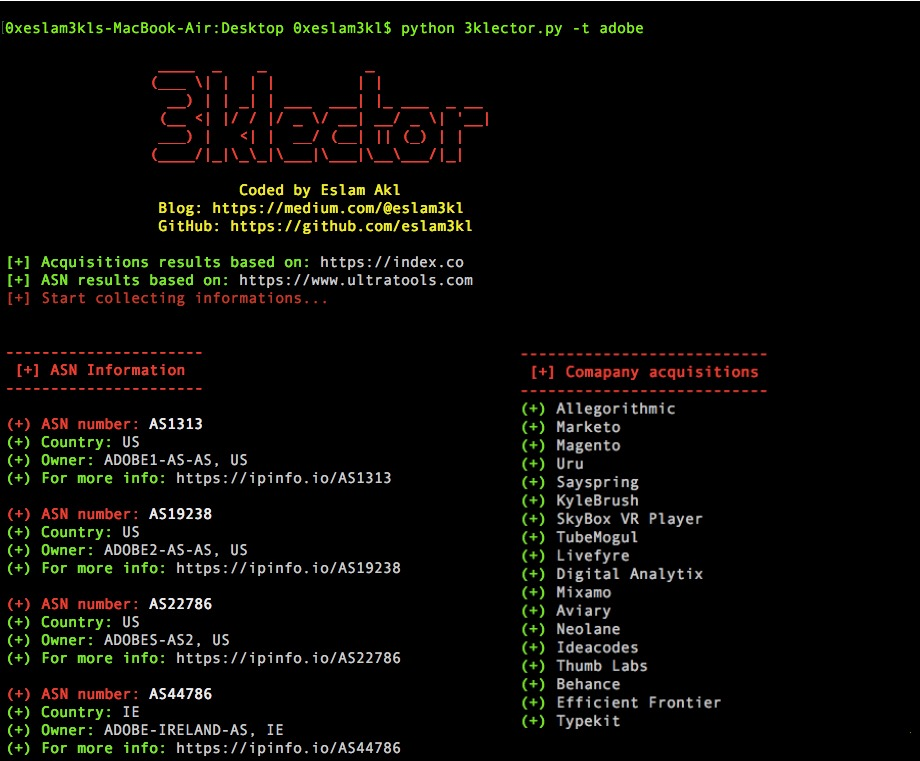

# Description
3klector is an automation Recon tool which collecting information about **Acquisitions** and **ASN** which related to Big Scope company in Penetration testing/Bug Hunting process. 

## Install 
` pip install -r requirements.txt ` 

## Usage 
` python 3klector.py -t target `

For the target should be the comapny name like *google* or *microsoft* or something like that 

## Website used 
> Acquisitions results based on: https://index.co                   
> ASN results based on: https://www.ultratools.com

------------------------------

***If you see it helpful be free to share & star & fork <3***
